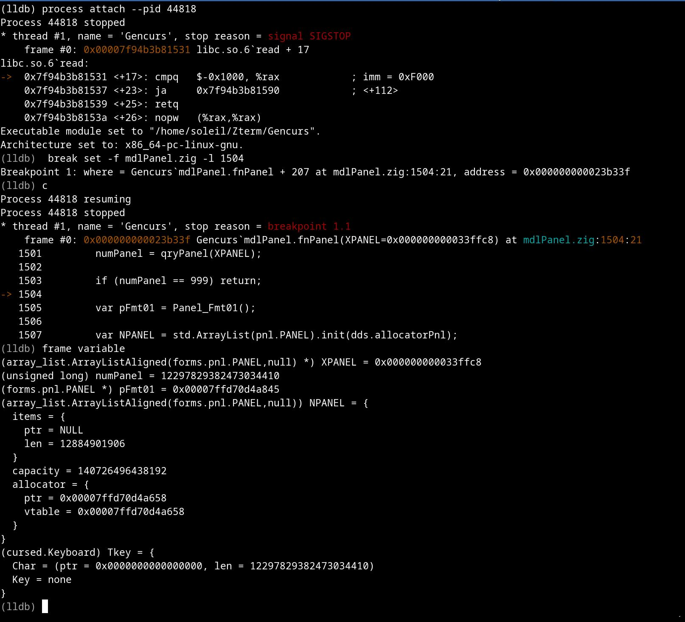
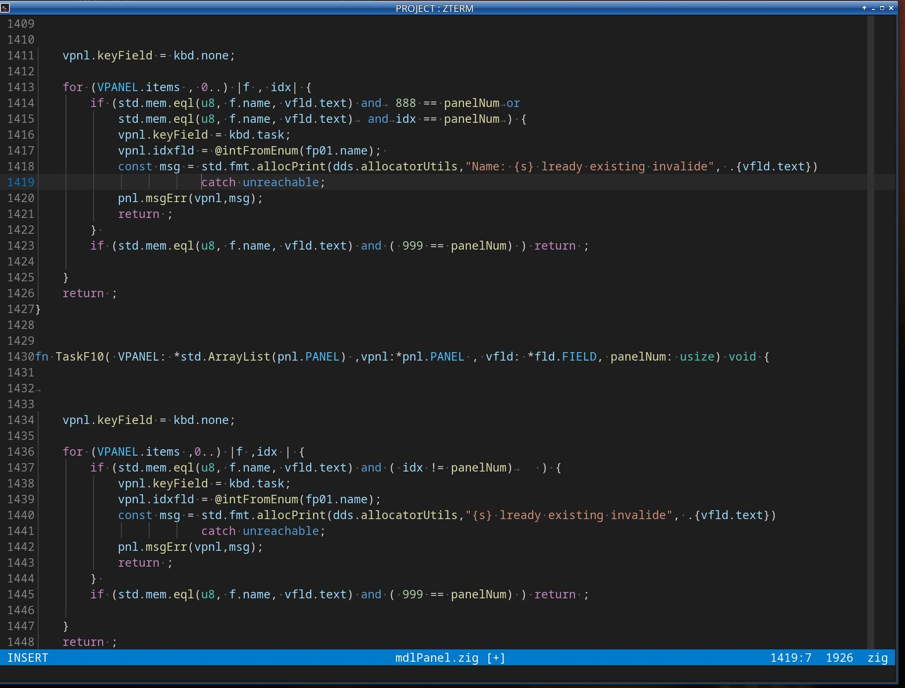

**Helix**

**2003-09-25 Updated search for last source saved with "write-buffer-close" or "wbc" sorry**  
**Unable to securely access name and directory I bypassed it, please read below**

_After a few problems... & a few scares..._  
_I switch from VSCode ide to helix-editor_  
_I need an editor, maybe less plugin...,_  
_but it does exactly what I ask it to do._

Setting up Helix, I work with Linux, you will find in your distribution how to install it.

To develop, it is better to have an installation of ZIG / ZLS, in your HOME, think about changing the version, this allows you to test more easily

https://helix-editor.com/

a) install Zig https://ziglang.org/download/  

b) install Zls LSP [https://github.com/zigtools/zls](https://github.com/zigtools/zls)

c) install lldb (pacman -S lldb) for manjaro or arch  include   lldb-vscode  recommend for Helix and ZIG

d) _Look at the “enScript” folder: a module to list your source files on the printer_ (pacman -S enscript)

c) **I provide a set of small BASH procedures (which are very simple, modifiable as desired). This will give you a lot of flexibility**

d) A tool is available to you TermHx a small 23kb terminal

\_\_\_\_\_\_\_\_\_\_\_\_\_\_\_\_\_\_\_\_\_\_\_\_\_\_\_\_\_\_\_\_\_\_\_\_\_\_\_\_\_\_\_\_\_\_\_\_\_\_\_\_\_\_\_\_\_\_\_  

personally I put Zig in ./zig and zls in ./zls  

in .profile

add matching paths and aliases  

```plaintext
  export PATH=/home/soleil/.zig:$PATH  

  export PATH=/home/soleil/.zls:$PATH    
```

\_\_\_\_\_\_\_\_\_\_\_\_\_\_\_\_\_\_\_\_\_\_\_\_\_\_\_\_\_\_\_\_\_\_\_\_\_\_\_\_\_\_\_\_\_\_\_\_\_\_\_\_\_\_\_\_\_\_\_

.config/helix/  

config.toml file concerns the editor settings  

After searching and gathering the most important and cool points

I thank the various authors...  

tested and bug-free  

\_\_\_\_\_\_\_\_\_\_\_\_\_\_\_\_\_\_\_\_\_\_\_\_\_\_\_\_\_\_\_\_\_\_\_\_\_\_\_\_\_\_\_\_\_\_\_\_\_\_\_\_\_\_\_\_\_\_

mytheme.toml  

origine (dark\_plus) very few modifications "|" for the indentation { }...  

a note in config.toml

I put the relationship.

theme = "mytheme"  

copy mytheme to /usr/lib/helix/runtime/themes/

\_\_\_\_\_\_\_\_\_\_\_\_\_\_\_\_\_\_\_\_\_\_\_\_\_\_\_\_\_\_\_\_\_\_\_\_\_\_\_\_\_\_\_\_\_\_\_\_\_\_\_\_\_\_\_\_\_\_

<table><tbody><tr><td>.cache/helix</td><td>.config/helix</td></tr></tbody></table>

cache/helix  → Contains  helix.log  and  archiveFile.log

.config/helix →Contains  config.toml , langage.toml , mytheme.toml

<table><tbody><tr><td>&nbsp;</td><td>&nbsp;</td><td>&nbsp;</td><td>&nbsp;</td><td>Zterm</td><td>&nbsp;</td><td>&nbsp;</td><td>&nbsp;</td><td>&nbsp;</td><td>&nbsp;</td></tr><tr><td>&nbsp;</td><td>&nbsp;</td><td>Print</td><td>&nbsp;</td><td>src-c</td><td>&nbsp;</td><td>src-zig</td><td>&nbsp;</td><td>&nbsp;</td><td>&nbsp;</td></tr><tr><td>&nbsp;</td><td>&nbsp;</td><td>&nbsp;</td><td>&nbsp;</td><td>&nbsp;</td><td>&nbsp;</td><td>deps</td><td>&nbsp;</td><td>&nbsp;</td><td>&nbsp;</td></tr><tr><td>&nbsp;</td><td>&nbsp;</td><td>&nbsp;</td><td>&nbsp;</td><td>&nbsp;</td><td>&nbsp;</td><td>&nbsp;</td><td>curse</td><td>&nbsp;</td><td>&nbsp;</td></tr><tr><td>&nbsp;</td><td>&nbsp;</td><td>&nbsp;</td><td>&nbsp;</td><td>&nbsp;</td><td>&nbsp;</td><td>&nbsp;</td><td>lib</td><td>&nbsp;</td><td>&nbsp;</td></tr><tr><td>&nbsp;</td><td>&nbsp;</td><td>&nbsp;</td><td>&nbsp;</td><td>&nbsp;</td><td>&nbsp;</td><td>&nbsp;</td><td>decimal</td><td>&nbsp;</td><td>&nbsp;</td></tr></tbody></table>

ZIG project my architecture

Zterm → Contains compiled programs and Folders

Print    → Contains Docs

src-c    → source C/C++

src-zig → Contains source and build, folders( deps,lib )

deps    → Contains  folders import  

                  curse   → Contains source import

                  lib        → source.h  ex: link libpcre2-posix.so 

                  decimal → source   import  link mpdecimal.so 

\_\_\_\_\_\_\_\_\_\_\_\_\_\_\_\_\_\_\_\_\_\_\_\_\_\_\_\_\_\_\_\_\_\_\_\_\_\_\_\_\_\_\_\_\_\_\_\_\_\_\_\_\_\_\_\_\_\_

This is an example of an environment :

for me: using Zig-lang, I configured it and I no longer have link errors with LSP and the language is well recognized.  

Now the tools to compile and a console.  

My compilation tools are pretty much the same as VSCODE and task.  

I have a ".Terminal" folder in which the procedures are located  

_**I only use the terminal ex: xfce4-terminal**_

EnvZig.sh

```plaintext
compile: zig build / doc ....

 1. ClearProjet (only cache compile )

 2. Compile_Debug

 3. Compile_Prod

 4. Compile_Safe

 5. Compile_Small

 6. Compile_test

 7. Compile_Doc
```

The compilations are done with a build which allows a lot of flexibility and incorporates all the settings

EnvCPP.sh

```plaintext
compile: gcc... c/c++

1. ClearProjet

2. Compile_Debug

3. Compile_Prod
```

The compilations are done with a Makefile which allows a lot of flexibility and incorporates all the settings

MenuDEV.sh

```plaintext
        Langage-ZIG-LANG - Project:  .....

    ------------compile cpp-----------------
 1. Terminal-Gen

    ------------compile Zig-----------------
11. Gencurs

12. app/module

13. study

    ----------------------------------------
33. Debug LLDB

44. enScript Printer

55. Edit my project

66. Edit last source used

77. clear helix.log

88. Console

99. Exit
```

  1 → Secure terminal for a Client application

11 → ex: Code generator from a designor   

12 → Module under test for integration with Gencurs

13 → Learning the ZIG language

33 → debeugeur LLDB 

44 → List of your print-ready source files

55 → Opening Helix --default-working-directory PROJECT/src-zig

66 → Opening Helix: searches for the latest record in ".cache/helix/archiveFile.log"   

77 → cleaning the helix.log file

88 →  Opening Standard console simulation for customer application testing or other

When you are in the Helix environment:

**To retrieve the latest source, you have to A-q keymap (Alt-q)**  
**please look at the config.toml please**

```plaintext
        Path :/home/soleil/Zterm/src-zig

        q = exit
        ----------------------------------------
        Name source :  mdlRjson.zig
```

Archive the source: date Time path name allows you to have a follow-up and gives the possibility of opening the last source on which you were.

Recording in the ".cache/helix/archiveFile.log" example

"2023-09-25 20:54:12 file:///home/soleil/Zterm/src-zig/Gencurs.zig"

At the moment we do not have access to the file name to include directly in archiveFile etc..

\_\_\_\_\_\_\_\_\_\_\_\_\_\_\_\_\_\_\_\_\_\_\_\_\_\_\_\_\_\_\_\_\_\_\_\_\_\_\_\_\_\_\_\_\_\_\_\_\_\_\_\_\_\_\_\_\_

option 33 :  debugZig.sh

Pacman -S lldb    package includes  ( ldb - lldb-argdumper - lldb-instr - lldb-server - lldb-vscode )

```plaintext
PID ?
q = exit
```

The script runs in a separate window "pkexec (sudo) lldb attach PID"

   

\_\_\_\_\_\_\_\_\_\_\_\_\_\_\_\_\_\_\_\_\_\_\_\_\_\_\_\_\_\_\_\_\_\_\_\_\_\_\_\_\_\_\_\_\_\_\_\_\_\_\_\_\_\_\_\_\_

option: 44 enScript form source to printer

look folder enscript

```plaintext
        Path :/home/soleil/Zterm/

        q = exit
        ----------------------------------------

        Path source :  src-zig

        Name source :  mdlRjson.zig

        ----------------------------------------

        Paper Size  ; A4 / A3 / Letter

        Size : A3
```

\_\_\_\_\_\_\_\_\_\_\_\_\_\_\_\_\_\_\_\_\_\_\_\_\_\_\_\_\_\_\_\_\_\_\_\_\_\_\_\_\_\_\_\_\_\_\_\_\_\_\_\_\_\_\_\_\_\_\_

Coming back to the difference between VSCODE and HELIX  
is that I had direct action from VSCODE,  
because there is no integrated terminal or possibility of communication from helix and program. RUST security.

But the LSP is meaner than on vscode, so we find it.  

The learning curve is relatively uncomplicated than vim... on the other hand, you have to take the time to practice the tutorial.  

The gain: no more madness in the propagation of caches and various logs and memory extension.  

The gain: no more madness in the propagation of caches and various logs and memory extension.  

I've done quite a few tests of neovim by the way, gvim, kakoune, lite-xl, geany, codeblock, sublime, atom, builder, and a few others, I think this one is the right one, it's still missing one or two things, but not vital.

    
start informatique 1976 middle systeme  

my big stops on PC since 1985

Metroworks CodeWarrior. trubo pacal etc.

codeblock, my first more than 25 years ago,

geany, has been my utility for a long time

builder, my sewing machine

vscode ......... in short, I keep it stanbye. (this was a serious advance on PC as a code editor)

more than 50 years ago IBM was 50 years ahead and the LSP was integrated but proprietary

\_\_\_\_\_\_\_\_\_\_\_\_\_\_\_\_\_\_\_\_\_\_\_\_\_\_\_\_\_\_\_\_\_\_\_\_\_\_\_\_\_\_\_\_\_\_\_\_\_\_\_\_\_\_\_\_\_\_

so HELIX is small in size, but does a good job

**After working, and spending some time to find the configuration tips, "copy/paste" the most coherent theme, e.g.: brackets and adjustment of the language definition etc. It's starting to be effective**

Lorenzo Sétale and Rajasegar Chandran thank-you

I'm working with "helix" and restructuring my sources, because I encounter the end of line positions and spaces are completely inconsistent. 

We can't really do without visualizing spaces, and colors can quickly become inconsistent and unpleasant. 

*   I think that there, I will stabilize.  
    helix --health zig  
    Configured language server: zls  
    Binary for language server: /home/soleil/.zls/zls  
    Configured debug adapter: lldb-vscode  
    Binary for debug adapter: /usr/bin/lldb-vscode  
    Highlight queries: ✓  
    Textobject queries: ✓  
    Indent queries: ✓

 

2023-09-22  **After testing**

*   new mytheme  : comes from  dark\_plus > vscode  
    .
*   menu  option 88 console  :   
    Opening a console independently  
    .
*   Alt-q A-q free combination  last update small adjustment menu and copyZig and lastFileZig  
    .
*   2023-10-03 update langage.toml and config.toml  
    There is very little action on the settings already in place, so let it be and opt for the minimum authorized (less inconsistency with Hélix)  
    .
*   2023-10-06 **Important, you must not replace tabs with spaces. To do this, you must declare voir le config.toml**

<table><tbody><tr><td>[editor.whitespace.render]<br>space = "all"<br>tab ="all"<br>[editor.whitespace.characters]<br>space = "·"<br>tab = "→"</td></tr></tbody></table>

*   During an update of VSCODE, the settings changed and my source files became a real hassle. You can resume, with for example "mousepad" a word processor where all the characters are displayed and change the points to tabulation etc. Be careful, you have to go there with little slippers.  
    .
*   2023-10-08 add debug , clean procedure \*.sh  
    .
*   2023-10-08 The debug mode with HELIX is experimental, it does not work completely, for example, we do not obtain the value of the variables in the submodules in a clear way. With the LLDB program you have a complete mode, lldb-vscode is a derivative of lldb But it's strictly the same with VSCODE.      lldb: it is possible to use GUI order  (tui) to have an overview     Point at objects etc... in console mode and follow step by step   
    .
*   2023-10-09  _I'm sorry, my restructuring of the sources, the copy and paste, now I'm back on my project, so I use HELIX and the small tools daily._  
    .
*   2023-10-11  Added choice of A4 - A3 - Letter paper   for option 44   
    .
*   2023-10-11  Saving the name of your current work with "Alt-q" removing "file:///home…" the ABSOLUTE PATH ONLY  “file:/home…”  
     
*   2023-10-20  _**important possibility:**_  
     

```plaintext
Consideration of a mini Terminal based on the VTE3 library.
More security (no "close" button) only ALT-F4 or normal closing of the "Helix" editor.
Very light. TermHx 8mo
Font "Noto Sans Mono".
We obtain the same rendering as "xfce4-terminal".
Possibility of having several working sessions (attention LSP will suffer).
No more keys to configure in the terminal
All keyboard keys are available. Except Alt-F4
```

*   For those who want to keep the traditional terminal system: bash\_lastFile.sh and bash\_myProject.sh.  
     
*   the terminal is located in the src-c folder TermHX.cpp and the Makefile   
     
*   modification     config.toml  
     “auto-save”.  Example, you want to compile by changing the window focus automatically, saving your source is done.  
    "auto-signature-help" = false.   LSP is still in development, the overhead is painful. (idem avec VSCODE)  
     #bufferline = "multiple", Easier to get started. With multiwindowing, buffers etc.